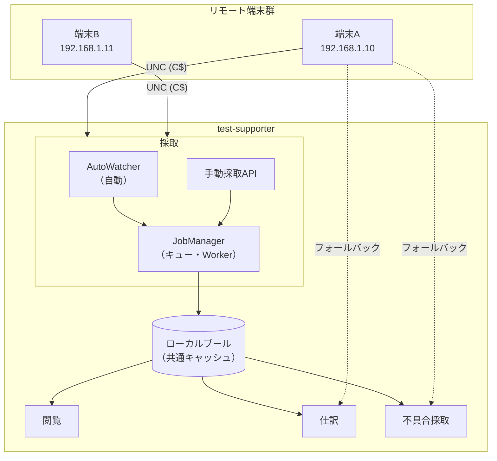
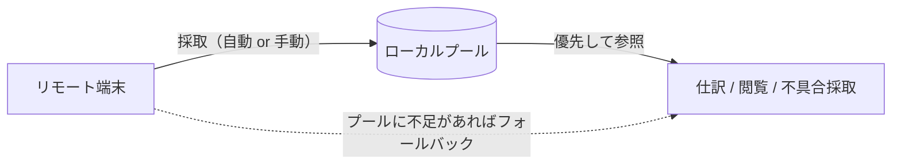

# システム全体アーキテクチャ

## 概要

ウォーターフォール開発の結合テスト・総合テスト業務を効率化するツール。
リモート端末上のテスト成果物を採取・閲覧・仕訳する。

## 主要機能

| 機能 | 概要 |
|------|------|
| **採取** | リモート端末からファイル・SS・ログをローカルプールに取得する |
| **閲覧** | 採取データの表示・フォーマット。リモート直接閲覧も可能 |
| **仕訳** | テスト仕様書と紐づけてフォルダ分けし再保存する |
| **設定** | 顧客プロファイルごとの接続先・仕様書などを管理する |

## システム構成



## プール＝キャッシュ思想



- **採取**はプールに貯めるだけ
- **仕訳・閲覧・不具合採取**はプールから読む。プールにない場合のみリモートへ
- 不具合採取だけ例外：ログの直採取（リアルタイムキャプチャ）が追加される

## 技術スタック

| 層 | 技術 |
|----|------|
| バックエンド | FastAPI（Python） |
| フロントエンド | React + Vite（TypeScript） |
| リモートアクセス | Windows 管理共有（UNC: `\\IP\C$\...`） |
| ローカルDB | SQLite（採取完了記録・検索用） |

## ドキュメント構成

```
docs/
  architecture.md              ← このファイル（全体俯瞰）
  features/
    collection/                ← 採取機能
      requirements.md          ← 要件
      design.md                ← 設計
      schema.md                ← CopyJob・metadata等
      decisions.md             ← 設計の意思決定
    sorting/                   ← 仕訳機能（未作成）
    viewing/                   ← 閲覧機能（未作成）
  schema/
    config.md                  ← 設定ファイルスキーマ
    db.md                      ← DBスキーマ（未作成）
    api.md                     ← APIスキーマ（未作成）
```
