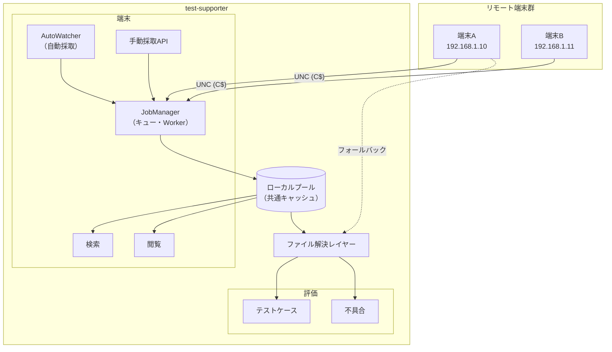

# システム全体アーキテクチャ

## 概要

ウォーターフォール開発の結合テスト・総合テスト業務を効率化するツール。
リモート端末上のテスト成果物を採取・閲覧・評価する。

## UI 領域の構成

UIは3つの領域に分かれる。

| 領域 | 概要 |
|------|------|
| **設定** | 顧客プロファイル・端末マスタの管理 |
| **端末** | 採取・閲覧・検索（エントリ/画像/ログ） |
| **評価** | テストケースへのエビデンス紐付け・不具合管理 |

## 概念モデル

```
【設定】
  顧客プロファイル
    └── 端末マスタ（IP・接続設定・採取設定など）

【端末】
  検索
    └── エントリ
  閲覧
    └── エントリ / 画像 / ログ（各独立した画面）
  採取
    ├── 自動採取 → プール
    └── 指定採取 → プール

【評価】
  テストケース（テスト仕様書と紐付け）
    └── エビデンス → ファイル取得API（透過）
  不具合（テストケースに任意紐付け、または単独起票）
    └── 資料 → ファイル取得API（透過）
```

## システム構成



## ファイル解決レイヤー

エビデンス・資料のファイル取得はバックエンドが透過的に解決する。
フロントエンドは「ファイルをください」と要求するだけ。

```
ファイル取得API
  → プールを検索
      ヒット → プールから返す
      ミス   → 端末直接アクセス → 返す（採取インフラ流用）
```

## 共用コンポーネント

| コンポーネント | 用途 |
|--------------|------|
| エントリ検索 | 端末タブでの検索 / 評価でのエビデンス選択 |

## 技術スタック

| 層 | 技術 |
|----|------|
| バックエンド | FastAPI（Python） |
| フロントエンド | React + Vite（TypeScript） |
| リモートアクセス | Windows 管理共有（UNC: `\\IP\C$\...`） |
| ローカルDB | SQLite（採取完了記録・検索用） |

## ドキュメント構成

```
docs/
  architecture.md              ← このファイル（全体俯瞰）
  roadmap.md                   ← 機能別進捗
  features/
    collection/                ← 採取機能（端末領域）
      requirements.md
      design.md
      schema.md
      decisions.md
      roadmap.md
    terminal/                  ← 端末領域（閲覧・検索）
      requirements.md
    evaluation/                ← 評価領域（テストケース・不具合）
      requirements.md
    settings/                  ← 設定領域
      requirements.md
  schema/
    config.md                  ← 設定ファイルスキーマ
    db.md                      ← DBスキーマ（未作成）
    api.md                     ← APIスキーマ（未作成）
```
