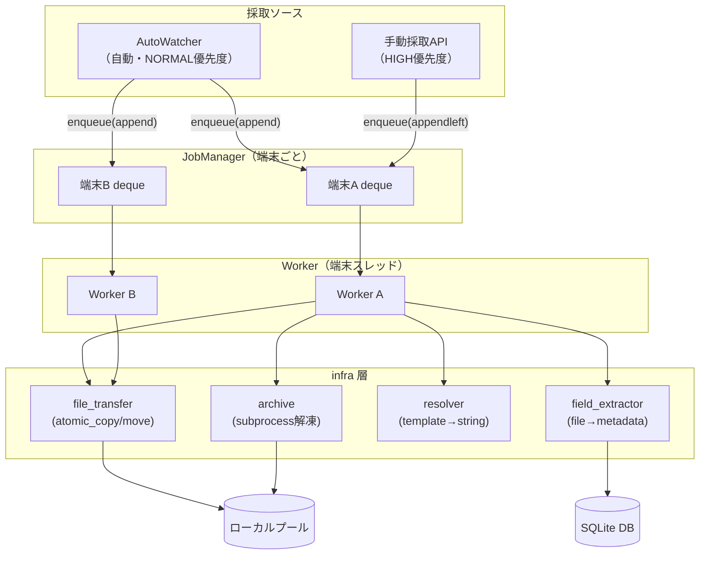
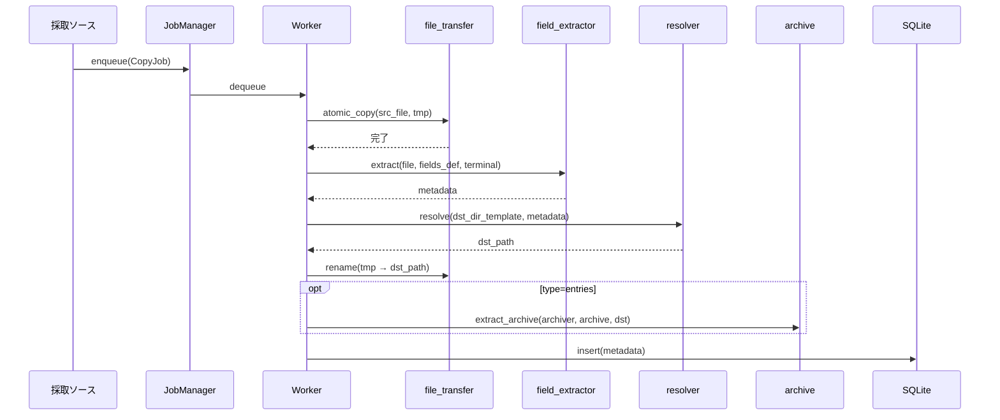
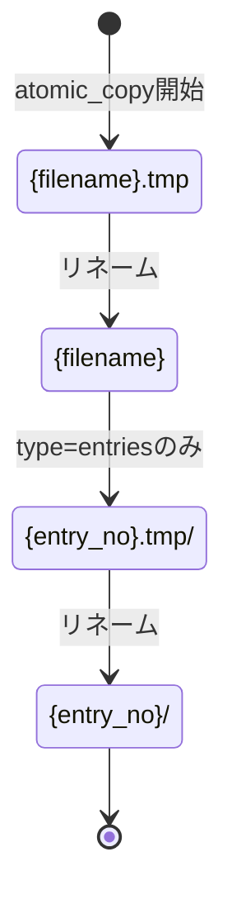

# 採取 設計

## アーキテクチャ



## データフロー



## CopyJob

```python
@dataclass
class CopyJob:
    terminal: str    # 端末IP
    src_file: Path   # 採取ソースが解決済みのUNCパス
    target: SyncTarget
    # statusフィールドなし（FSが状態を管理する）
```

## 採取ソースの責務

### AutoWatcher（自動採取）

```
① SyncTarget.pattern で新着ファイル一覧取得（拡張子フィルタ等）
② ローカルプールと差分計算
③ 新着ファイルを enqueue（priority=NORMAL → 末尾）
```

speed優先のため、field_extractor は使わない。

### 手動採取（Manual）

```
① UI から field値（entry_id範囲・時刻範囲など）を受け取る
② field定義を元に検索用パターンを生成
③ リモートから一致ファイルを取得
④ enqueue（priority=HIGH → 先頭）
```

field_extractor は使わない（Workerが使う）。

## Worker の処理

```
① atomic_copy(src_file, dst_tmp)          ← file_transfer
② field_extractor(src_file, fields_def, terminal) → metadata
③ resolver(target.dst_dir, metadata)      → dst_path
④ resolver(target.rename, metadata)       → dst_filename（renameある場合）
⑤ dst_tmp を正式名にリネーム
⑥ extract_archive(...)                    ← archive（type=entriesのみ）
⑦ DB insert(metadata)
```

## アトミックリネームによる完了管理



### リトライ判定（FSのみで完結）

| ファイルシステムの状態 | 次の動作 |
|---|---|
| 完了済みファイル / ディレクトリが存在 | スキップ |
| `.tmp` あり | .tmp削除 → 再実行 |
| 何もない | 新規実行 |

## infra 層の構成

```
app/infra/
  unc_path.py        - Windowsパス → UNCパス変換（純粋関数）
  file_io.py         - 読み取り系（一覧・メタデータ・内容取得）
  file_transfer.py   - 転送系（atomic_copy・atomic_move）
  archive.py         - subprocess解凍
  field_extractor.py - ファイル → metadata dict（Worker専用）
  resolver.py        - template + metadata → 文字列
```

| ファイル | 採取 | 閲覧 | 仕訳 |
|---------|:----:|:----:|:----:|
| `file_io.py` | ○ | ○ | ○ |
| `file_transfer.py` | ○ | - | ○ |
| `field_extractor.py` | ○ | - | - |
| `resolver.py` | ○ | - | - |
| `unc_path.py` | ○ | △ | - |
| `archive.py` | ○ | - | - |

## services 層の構成

```
app/services/
  job_manager.py   - CopyJobキュー管理・端末ごとのWorkerスレッド
  copy_runner.py   - run_copy(job)：Worker実処理
  auto_watcher.py  - 自動監視（pattern→新着→enqueue）
  selector.py      - 手動採取（UI field値→pattern→対象ファイル）
```

## エラー処理方針

- 設定ファイルのバリデーションは厳しくしない（開発者向け設定）
- エラー時はログをちゃんと吐く（担当者がログを見て修正できるレベル）
- DB はジョブ管理に使わない（FS状態で管理）
